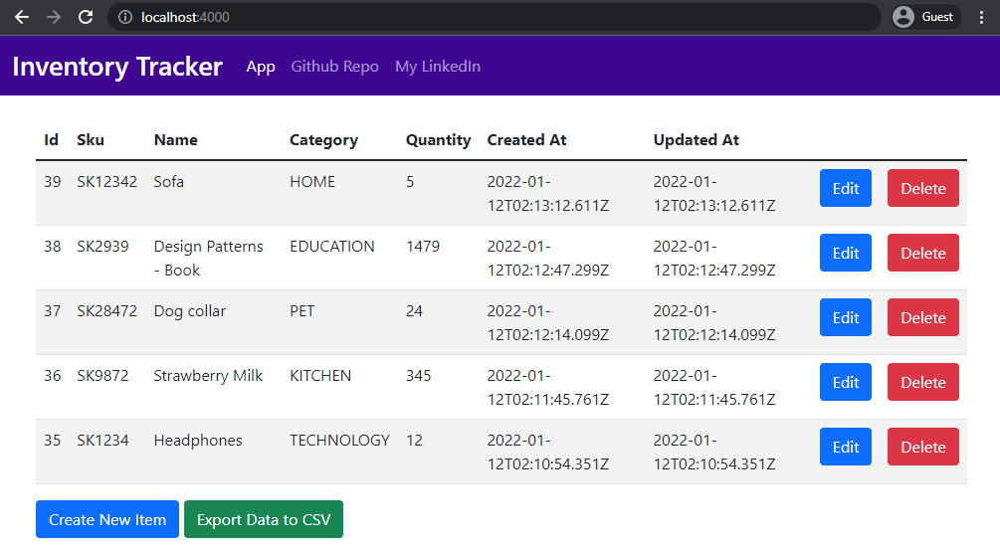
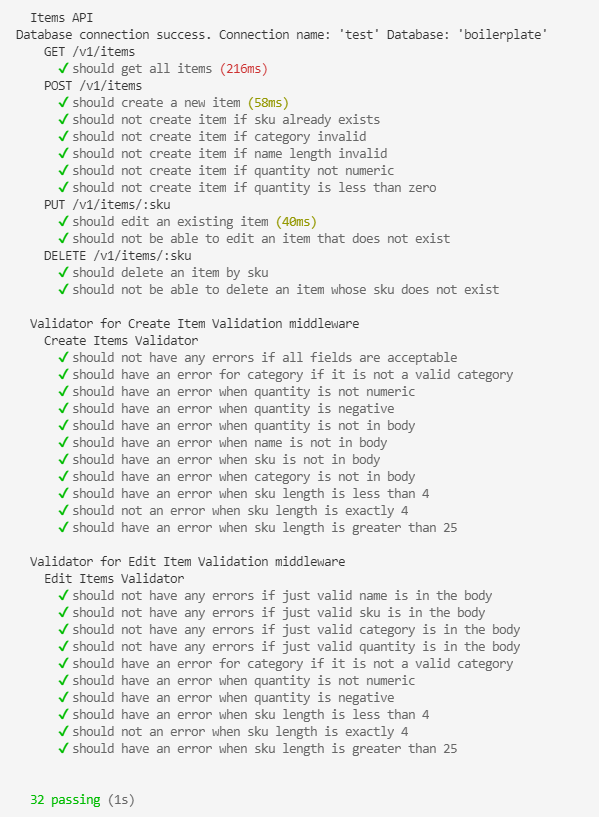

# Inventory Tracker App
### Shopify Backend Developer Intern Challenge - Summer 2022
An inventory tracking web application for a logistics company.

## Requirements

- [Node v16+](https://nodejs.org/)
- [Docker](https://www.docker.com/)

## Quick start
### Running the app

_Easily set up a local development environment with single command!_

- clone the repo
- `npm run docker:dev` 🚀

Visit [localhost:4000](http://localhost:4000/) to view the app.

### _What happened_ 💥

Two docker containers are created:

- one container instance with Postgres database. Postgres database default credentials are in [.env file](./.env) (not added to .gitignore for demo purposes).
- and one Node (v16 Alpine) container instance with running RESTful API service and hosting static frontend.

### Running the tests

- run the app using the instructions above and run the tests in the backend docker container using the commands below
- `docker exec -it backend_container bash`
  - `npm run test`

## Features:

- Create, Read, Update, Delete Items
- Generate CSV of items with one click of a button

## View Documentation of endpoints
[Simple Swagger Generated Documentation of Endpoints](https://wenogk.github.io/inventoryTrackerBackend/swagger.html)

## Technical details and features 
- [Express](https://github.com/expressjs/express) framework
- [TypeScript v4](https://github.com/microsoft/TypeScript) codebase
- [TypeORM](https://typeorm.io/) using Data Mapper pattern
- [Docker](https://www.docker.com/) environment:
  - Easily start local development using [Docker Compose](https://docs.docker.com/compose/) with single command `npm run docker:dev`
  - Connect to different staging or production environments `npm run docker:[stage|prod]`
  - Ready for **microservices** development and deployment.  
    Once API changes are made, just build and push new docker image with your favourite CI/CD tool  
    `docker build -t <username>/api-boilerplate:latest .`  
    `docker push <username>/api-boilerplate:latest`
- Contract first REST API design:
  - never break API again with HTTP responses and requests payloads using [type definitions](./src/types/express/index.d.ts)
  - Consistent schema error [response](./src/utils/response/custom-error/types.ts). Your frontend will always know how to handle errors thrown in `try...catch` statements 💪
- Set local, stage or production [environmental variables](./config) with [type definitions](./src/types/ProcessEnv.d.ts)
- Logging with [morgan](https://github.com/expressjs/morgan)
- Integration tests with [Mocha](https://mochajs.org/) and [Chai](https://www.chaijs.com/)
- Linting with [ESLint](https://eslint.org/)
- [Prettier](https://prettier.io/) code formatter
- Git hooks with [Husky](https://github.com/typicode/husky) and [lint-staged](https://github.com/okonet/lint-staged)
- Automated npm & Docker dependency updates with [Renovate](https://github.com/renovatebot/renovate) (patch version only)
- Commit messages must meet [conventional commits](https://www.conventionalcommits.org/en/v1.0.0/) format.  
  After staging changes just run `npm run commit` and get instant feedback on your commit message formatting and be prompted for required fields by [Commitizen](https://github.com/commitizen/cz-cli)

## Attributions:

- [Express / TypeScript / TypeORM RESTful API boilerplate was used in this project](https://github.com/mkosir/express-typescript-typeorm-boilerplate)

[build-badge]: https://github.com/mkosir/express-typescript-typeorm-boilerplate/actions/workflows/main.yml/badge.svg
[build-url]: https://github.com/mkosir/express-typescript-typeorm-boilerplate/actions/workflows/main.yml
[typescript-badge]: https://badges.frapsoft.com/typescript/code/typescript.svg?v=101
[typescript-url]: https://github.com/microsoft/TypeScript
[prettier-badge]: https://img.shields.io/badge/code_style-prettier-ff69b4.svg
[prettier-url]: https://github.com/prettier/prettier

## Contributing

All contributions are welcome!
